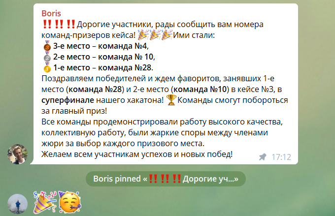

# Program_Boost_Eduthon 
Команда **№ 28**

Победитель Хакатона трека № 3 "ИИ в онлайн-школе"
Хакатон: https://pp-hack2021.ru/

Задача: построения предиктивной модели баллов ЕГЭ

## Полученная точност: 
* **train/test: RMSE = 14.8**
* **validation: RMSE = 11.8**

# Наше Решение:

# *Web-интерфейс работы решения*

# *Эволюция точности модели по мере добавления идей*

# Подробнее смотри в презентации:
EdTech_Boost_Presentation.pdf
