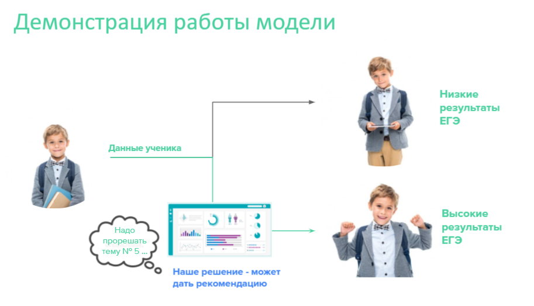
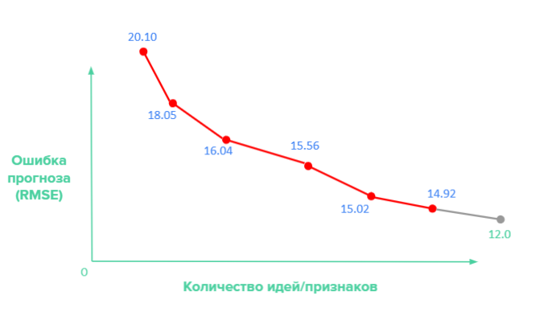

# Program_Boost_Eduthon 
Команда # 28
Результаты построения предиктивной модели

## *Полученная точност: 
* *train/test: RMSE = 14.8*
* *validation: RMSE = 11.8*

# *Web-интерфейс работы решения*

# *Эволюция точности модели по мере добавления идей*

